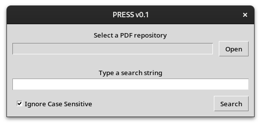
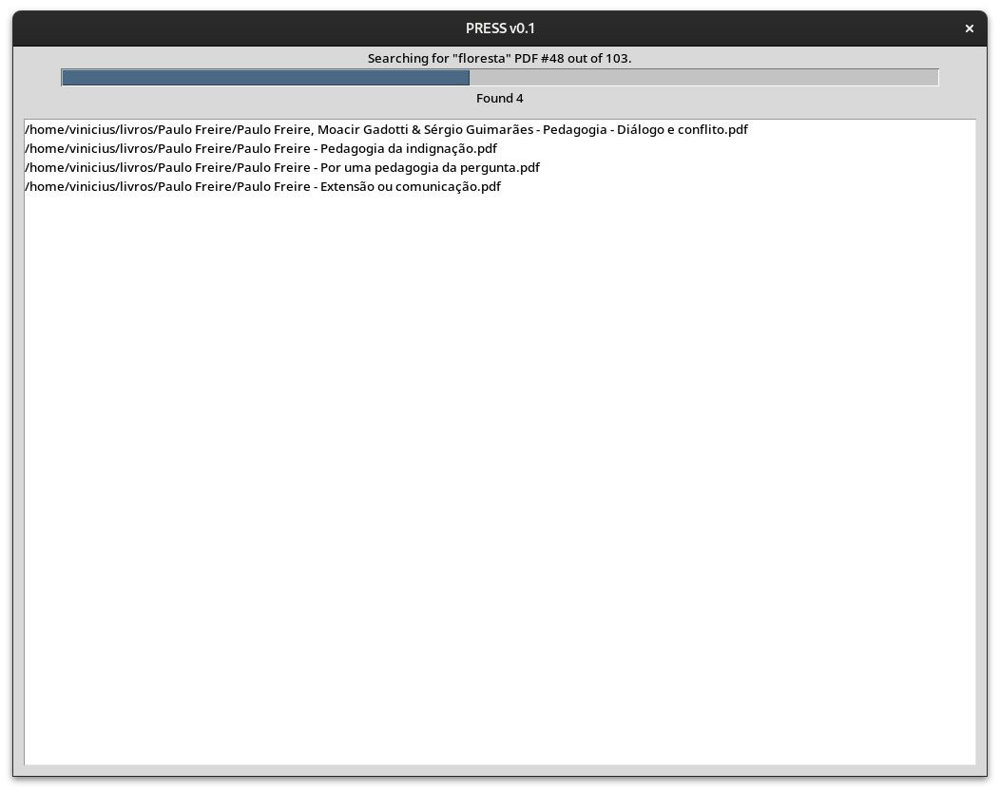
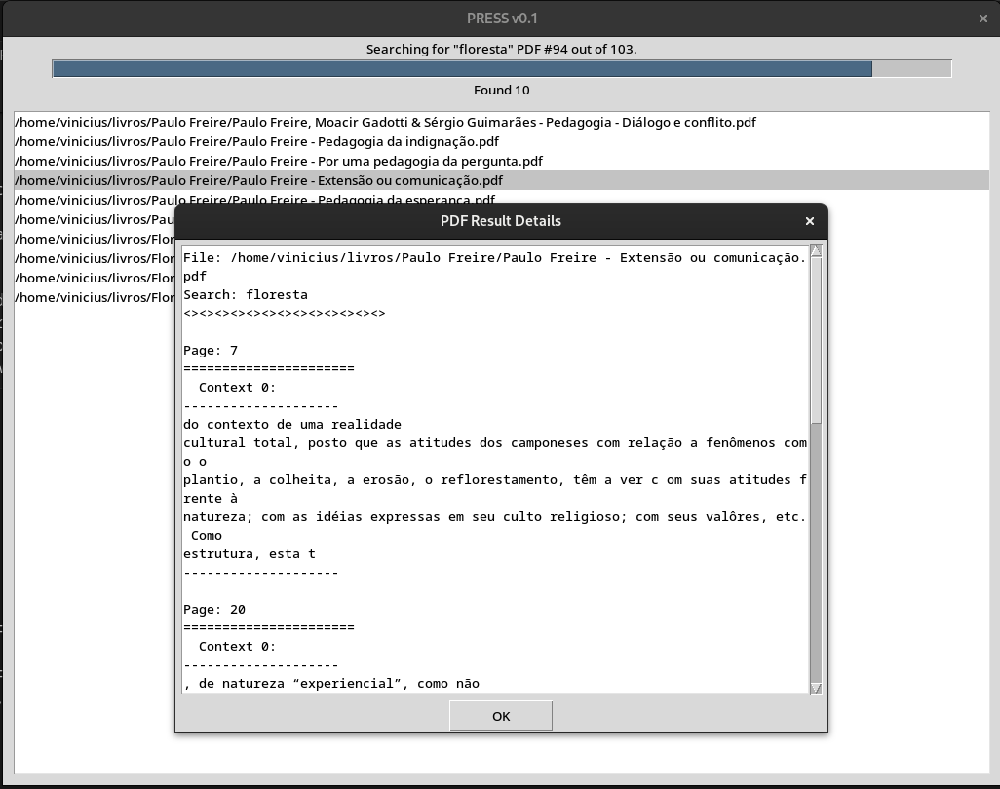

# This is PRESS: Pdf REpository String Search

PRESS is a **VERY** simple python software that search for strings inside PDF files in a local repository (a.k.a. directory full of pdfs).

Just do:

```bash
python3 press.py
```

<p align="center" width="100%">
    <br>
    <b>Figure: <i>Setting repository and string search.</i></b>
</p>

This is the simplest arguments you can use with PRESS. By clicking on `search`, PRESS will search all PDFs in selected repository that matches the string. Each match will show a context of 100 characters surrounding it and running in 6 jobs (PDFs) at a time. You can configure the surrounding text and the jobs, take a look at [Usage](#usage).

## How to run?

This app was developed using python 3. After the python installation, it is recomended that you create an execution virtual environment for the libraries used by this project. Use virtualenv for this. Install virtualenv package using pip an then create a virtual environment inside the PRESS repository directory. With an access to a terminal just type:

```bash
> pip install virtualenv     # virtualenv installation
> virtualenv .venv           # virtual environment creation
#------ Alternatively
> pip3 install virtualenv    # use pip3 when python2 and python3 are both available in the system
> python3 -m venv .venv      # virtual environment creation
```

After the first execution if you want to run the game again just repeat steps 1 and 3.

1. Activate the virtual environment

    ```bash
    # On windows
    > .\.venv\Scripts\activate

    # On GNU/Linux or other unix-like systems
    $ source ./.venv/bin/activate
    ```
    
    * Notice that by activating the virtual environment something like `(.venv)` appears at the beginning of the command line on terminal. This indicates that the virtual environment is activated. To deactivate, type `deactivate`.

2. If this is your first time running PRESS in this virtual environment, then you should install the dependencies:

    ```bash
    > pip install -r requirements.txt
    #------ Alternatively
    > pip3 install -r requirements.txt      # use pip3 when python2 and python3 are both available in the system
    ```

3. Inside the `src` directory execute PRESS:

    ```bash
    > python press.py
    #------ Alternatively
    > python3 press.py                       # use python3 when python2 and python3 are both available in the system
    ```


## Usage

By typing the line below:

```bash
python3 press.py -h
```

You'll see this:

```
usage: press.py [-h] [--ics] [--surc SURC] [--maxjobs MAXJOBS] [-v] [--dirpath DIRPATH] [--string STRING]

PRESS v0.1 - Pdf REpository String Search is a tool for mapping pdf files based in a string search

options:
  -h, --help         show this help message and exit
  --ics              Ignore Case Sensitive search
  --surc SURC        Surround context. The number of characteres surrounding the matching area. Shown on GUI when right button is pressed on the
                     result. (Default: 100)
  --maxjobs MAXJOBS  Maximum of threads running the search routines. Each thread will search in one PDF at time. (Default: 6)
  -v                 Verbose. This option shows the program status in text mode.
  --dirpath DIRPATH  Define a path to the directory where the PDF files are.
  --string STRING    A string regex for the search
```

If you run without declaring `--dirpath` or `--string`, you'll be prompted with a GUI:

```bash
python3 press.py
```

<p align="center" width="100%">
    <br>
    <b>Figure: <i>Setting repository and string search. Default maxjobs and surc</i></b>
</p>


## Running a search for "floresta" example using command line

This example will use all flags as demonstration:

```bash
python3 press.py --dirpath /home/vinicius/livros/ --string "floresta" --ics --surc 150 --maxjobs 12 -v
```

<p align="center" width="100%">
    <br>
    <b>Figure: <i>Searching progress with results on PRESS.</i></b>
</p>

If you select a result and right-click it, you'll see the pages where the search string were found and the matching contexts.

<p align="center" width="100%">
    <br>
    <b>Figure: <i>Matching contexts and page numbers.</i></b>
</p>

If you double click the result, PRESS will try to call the default PDF reader for the file path presented.
